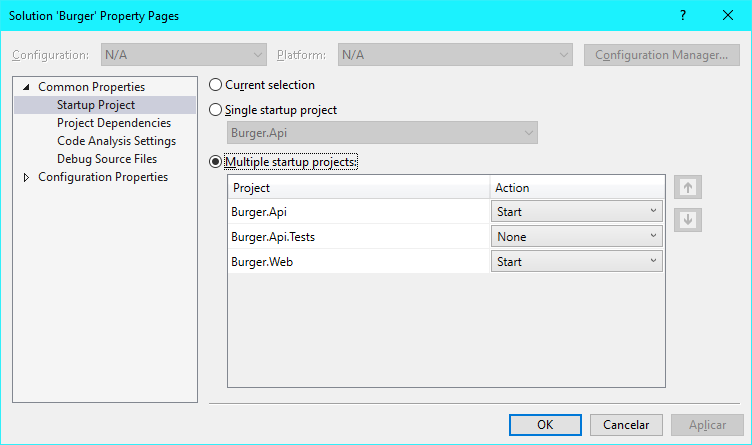

# Burger Delivery
Aplicativo web criado para um desafio e também para estudos.

## Instruções para execução

### Pré-requisitos

* Visual Studio 2017 (versão Community [aqui](https://www.visualstudio.com/vs/community/))
* .NET Framework 4.6.2 (instala junto com o Visual Studio)
* SQL Server 2012 ou mais recente
  * Pode ser a edição Express
  * Deve ter a opção de LocalDB instalada também

### Configurando a solução

Para que todas as aplicações, configurar a solução para iniciar ambas as
aplicações web e api, entrando na tela de configurações da solução e
selecionando a opção "**Multiple startup projects**":

Agora é só executar os projetos usando a opção "**Start Debugging**"/"**Start
Without Debugging**", do menu **Debug**:

## Design do código

O desafio solicitava que o *server-side* fosse desenvolvido usando-se **.NET**
e que o client-side fosse desenvolvido usando-se HTML, JavaScript com jQuery e
CSS.

Decidi seguir rigidamente as instruções e esses são os artefatos desenvolvidos:

  * Projeto ASP.NET usando Web API;
  * Web site apenas com conteúdo estático;
  * Projeto de testes.

### Projeto ASP.NET

Decidi criar apenas um projeto para o back-end por ser uma aplicação com o
escopo bem simples. Separar a solução em vários projetos nesse caso apenas
adicionaria uma complexidade desnecessária.

De qualquer forma, as classes de diferentes "camadas" estão separadas em
diferentes diretórios e *namespaces*. Dessa forma fica mais fácil uma possível
alteração da arquitetura da solução.

Apesar de não ser necessário o uso de banco de dados, decidi que seria mais
produtivo usar uma solução pronta e simples para persistência de dados. Essa
solução foi a combinação de **Entity Framework** e **SQL Server LocalDB**.

Junto com essa solução algumas operações são simplificadas e deixam o código
mais limpo (salvar os dados e realizar consultas, e relação entre entidades, por
exemplo).

#### Separação das classes

##### Controllers

Apenas três classes de *Controller* foram criadas no projeto. Duas delas são
muito simples, pois precisam apenas retornar uma lista de entidades cada uma.
Para essas duas operações não foi criada classe de **Service**, pois na
arquitetura atual do projeto essa classe serviria apenas como um passo a mais
e desnecessário para realizar uma consulta simples.

Essas duas controllers também utilizam a rota padrão do Web API, por serem mais
simples.

A outra classe *Controller* possui rotas personalizadas, definidas por
atributos, por possuir mais de um método para o mesmo verbo HTTP e pela
necessidade de ficar explícito o que cada *Action* deveria fazer.

Nessa controller também foi usada outra classe para executar ações mais
complexas, de regras de negócio da aplicação. Isso foi feito para que a
controller continuasse tendo apenas a função de "ponte" entre o frontend e as
regras da aplicação.

##### Data

Foi criada apenas uma classe de *Context* para o Entity Framework, que possui
todas as "tabelas" do sistema. Não havia necessidade de separação de contextos,
pela simplicidade do modelo de dados.

Também há uma classe customizada para a inicialização do Entity Framework, cuja
única função é criar os dados iniciais (*Seed*).

##### Models

As classes de *Model* do projeto possuem os atributos (propriedades) que serão
persistidos em banco de dados

Além disso, também possuem algumas propriedades e métodos de regras de negócio
que fazem parte das entidades, como por exemplo:
- O cálculo de preço de um pedido, que é a soma dos preços de todos os itens.
- Verificar se a entidade possui itens de um determinado tipo.

##### Services

Foi criada apenas uma classe *Service*, para a parte de pedidos da aplicação,
pois era a única funcionalidade que exigia regras de negócio complexas.

É nessa classe que ficam as regras de cálculo dos preços de itens dos pedidos,
inclusive de itens que se encaixam em promoções.

#### Edição de .NET

Foi usado o **.NET Framework** e não **.NET Core** por dois motivos:

1. Não possuo ainda conhecimento suficiente em .NET Core para fazer um projeto
   completo. Então eu precisaria estudar ainda para fazer esse projeto,
   reduzindo as chances de entregar algo funcionando bem.

2. Pelo que vi sobre o Entity Framework Core, ele ainda não possui todas as
   funcionalidades do EF 6, então correria o risco de não fazer algo da forma
   como gostaria.

### Site web

Decidi criar apenas um web site estático na solução por ser mais simples e
portável. Ou seja, da forma como está ele pode ser hospedado em qualquer
servidor HTTP (que suporte conteúdo estático), incluside o prório ISS Express.

Há apenas uma página (um arquivo HTML) e a aplicação funciona como um SPA. Há
somente uma folha de estilos (CSS) e alguns arquivos de JavaScript.

O arquivo "api.js" foi criado somente para executar métodos da Web API. Ele
possui um objeto simples com algumas funções que chamam a API, sem mais
complexidades. Não foi utilizada estrutura de classe nele pois não havia
necessidade desse nível de complexidade.

O arquivo "index.js" possui a lógica que faz a página da aplicação funcionar.
Foi utilizado apenas um arquivo para uma melhor produtividade, sem usar, por
exemplo, componentes para encapsular funcionalidades.

Foi utilizado o jQuery para executar funções de AJAX, para obter elementos da
página, atribuir e executar eventos e também para adicionar novos elementos à
página (renderizar elementos). Dessa forma, muito código que seria feito usando
apenas a biblioteca padrão do JavaScript e o DOM foi evitado.
