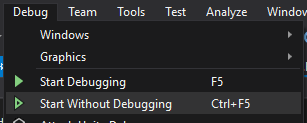

# Burger Delivery
Aplicativo web criado para um desafio e também para estudos.

## Instruções para execução

### Pré-requisitos

* Visual Studio 2017 (versão Community [aqui](https://www.visualstudio.com/vs/community/))
* .NET Framework 4.6.2 (instala junto com o Visual Studio)
* SQL Server 2012 ou mais recente
  * Pode ser a edição Express
  * Deve ter a opção de LocalDB instalada também

### Configurando a solução

Para que todas as aplicações, configurar a solução para iniciar ambas as aplicações web e api, entrando na tela de configurações da solução e selecionando a opção "**Multiple startup projects**":

Agora é só executar os projetos usando a opção "**Start Debugging**"/"**Start Without Debugging**", do menu **Debug**:

